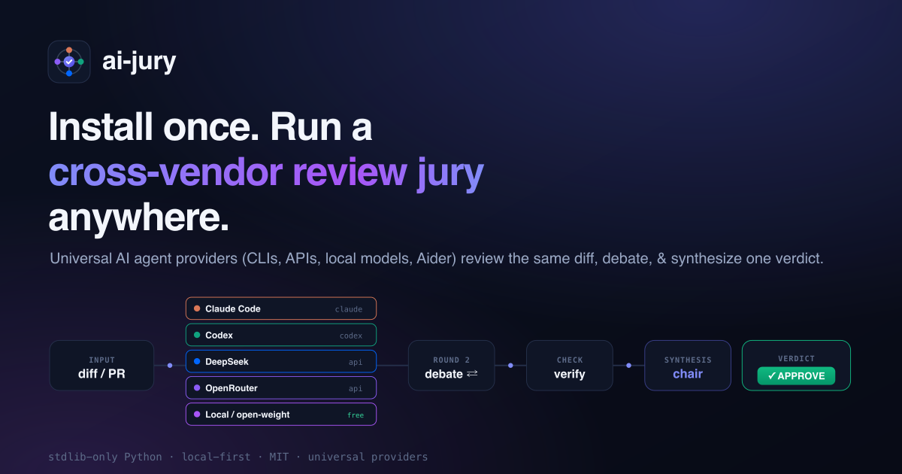

#  ai-jury

> Convene a **cross-vendor multi-agent review jury**: native coding-agent CLIs from
> different vendors review the *same* pull request, cross-examine each other, and a
> chair synthesizes one verdict.

[](https://github.com/berkayturanci/ai-jury/actions/workflows/ci.yml)
[](https://berkayturanci.github.io/ai-jury/coverage/)
[](https://github.com/berkayturanci/ai-jury/actions/workflows/codeql.yml)
[](https://github.com/berkayturanci/ai-jury/releases)
[](https://opensource.org/licenses/MIT)

<picture>
  <source media="(prefers-color-scheme: light)" srcset="docs/assets/hero-light.png">
  <source media="(prefers-color-scheme: dark)" srcset="docs/assets/hero.png">
  
</picture>

> **Install once. Run a cross-vendor review jury anywhere.**

Most "multi-model review" tools call models at the **API level**. This one drives each
vendor's **native CLI agent** — `claude` (Claude Code), `codex` (OpenAI Codex CLI), and
`agy` (Google Antigravity) — plus an optional **free, offline local / open-weight model**
(via Ollama or any OpenAI-compatible server), so every reviewer runs in its own native
environment with its own tooling. Each agent runs headless; the orchestrator owns the
round structure.

```
        ┌──────── round 1 ────────┐   ┌─ round 2 (adaptive) ─┐   ┌─ verify + synthesis ─┐
diff ──▶ claude codex agy qwen (review) ▶ each rebuts the      ▶ chair verifies, then   ▶ verdict
         (parallel, independent)           others' findings       consolidates             + report
```

Highlights: **free/offline** local reviews · **secure by default** (reviewers run
sandboxed/read-only) · `jury init` setup · debate + verification · **chair verdict
or a panel vote** · **review a PR, a diff, or an issue** · **live / full-transcript
output** · CI gating · incremental review · suggested patches · large-diff chunking.
Configure once in `jury.toml`; mix cloud CLIs and a local model however you like.

## Why

Different models miss different things. Running them as an adversarial panel — each
seeing the others' findings and arguing — surfaces more real issues and filters more
false positives than any single reviewer. The research-backed lever is **vendor
heterogeneity**, not more rounds — and a free local/open-weight model adds a *different*
perspective at **zero marginal cost**, so a jury needn't mean paying three vendors.
See [`docs/architecture.md`](docs/architecture.md) and
[`docs/feasibility.md`](docs/feasibility.md).

## Install

```bash
pipx install ai-jury         # once published; until then:
pipx install git+https://github.com/berkayturanci/ai-jury.git
# dev: pip install -e ".[dev]"
```

Requires Python 3.11+. Then scaffold a config with **`jury init`** (it detects your
installed agents and local models). You need at least one reviewer: an agent CLI
(`claude`, `codex`, `agy`) **or** a free local model via Ollama; missing/unreachable ones
are skipped. `gh` is needed for `--pr` / `--post`.

For development, install the dev extras (linting, build, and coverage tooling):

```bash
pip install -e ".[dev]"   # or: make install
```

## Coverage

Test coverage is measured with [`coverage.py`](https://coverage.readthedocs.io/)
— a **dev-only** dependency. The runtime stays standard-library-only.

Measure it locally with one command:

```bash
make coverage          # run the suite under coverage, print the report, write htmlcov/
# or, without make:
./scripts/coverage.sh
```

Either entry point runs:

```bash
python3 -m coverage run -m unittest discover -s tests
python3 -m coverage report
```

**Threshold.** The minimum total coverage is **99%**, configured once in
`pyproject.toml` under `[tool.coverage.report] fail_under` and enforced by a
dedicated `coverage` job in CI (`.github/workflows/ci.yml`, Ubuntu / Python
3.13). CI fails if total coverage drops below that floor. The gate runs in a
single job rather than across the whole test matrix to keep CI cheap and free of
cross-OS path noise.

**Measurement method.** Branch coverage is enabled (`branch = true`) and the
package is measured by import name (`source = ["ai_jury"]`).

**Exclusions.** Intentionally-untested paths are excluded so the number stays
honest:

- `src/ai_jury/__main__.py` is omitted (a thin `python -m` entry shim).
- Lines matching these patterns are excluded from the count: `pragma: no cover`,
  `if __name__ == "__main__":`, `raise NotImplementedError`, `if TYPE_CHECKING:`,
  and abstract-method decorators.

Add `# pragma: no cover` to any new line that is genuinely not worth testing.

## Live smoke tests

The default test suite uses **mock adapters only**, so the real native CLIs
are never invoked — a breakage in argv format, stdin handling, or output
capture in the concrete adapters would go unnoticed until a live run. The
optional **live smoke tests** close that gap: they run a tiny, cheap review
prompt (a two-line diff) through each *installed* real adapter and assert the
run succeeds (`ok`, non-empty output, `error_code is None`).

They are **opt-in** and skipped entirely unless `JURY_LIVE=1` is set, so
they never run in `make test` or in CI.

**Requirements** for a meaningful live run:

- The agent CLIs you want to exercise must be installed and on your `PATH`
  (`claude`, `codex`, `agy`) **and authenticated** for non-interactive use.
- Any agent whose CLI is not installed is **skipped individually**, so a
  machine with only `claude` still exercises that one adapter.

**Run them:**

```bash
make live-smoke
# equivalent to:
JURY_LIVE=1 PYTHONPATH=src python3 -m unittest discover -s tests -v
```

They are **intentionally excluded from the CI matrix** (no CLIs, auth, or
secrets are available there) and are meant to be run locally before a release
or when touching the adapter layer.

## Review-quality benchmark

A **small, directional** benchmark (`benchmark/`) measures whether a jury's
findings line up with hand-authored expectations for a handful of fixture diffs
(obvious logic bug, subtle boolean-guard bug, missing error handling, a
false-positive trap, and a docs-only change).

> It is **not a universal quality claim**. The default *offline* mode is
> deterministic and runs with **no live CLIs**: it scores each fixture's
> *recorded* sample findings against an expected spec, which validates the
> scorer and the recorded baselines — it does not measure live review quality.
> (`--mock` is deliberately not used per fixture: the mock adapter emits a fixed
> finding regardless of the diff, so it would be fake signal.) Only the opt-in
> *live* mode (`JURY_BENCH_LIVE=1`) runs real agents and measures quality.

```bash
make benchmark                                          # offline, deterministic
JURY_BENCH_LIVE=1 PYTHONPATH=src python3 -m ai_jury.benchmark  # live (opt-in)
```

See [`benchmark/README.md`](benchmark/README.md) for the fixture list, the
expected/recorded schema, and the match/scoring rules.

## Usage

```bash
jury init                              # scaffold jury.toml (detects agents + local models)
jury init --wizard                     # guided setup: numbered questions, every one skippable
jury init --preset balanced            # one-command setup from a preset (offline|fast|balanced|thorough)
jury --pr 123                          # review a GitHub PR
jury --pr 123 --auto                   # auto-depth: scale rounds/verify to the diff
jury --pr 123 --post                   # ...and post the verdict as a comment
jury --pr 123 --decision vote          # verdict by panel vote instead of a single chair
jury --issue 42                        # review an ISSUE for completeness/clarity (READY/NEEDS-INFO/UNCLEAR)
jury --issue 42 --decision vote        # issue verdict by panel vote (NEEDS-INFO > UNCLEAR > READY)
jury --issue 42 --live --post          # stream + post each step to the issue thread
jury --pr 123 --transcript             # full play-by-play (every review, debate, the reasoning)
jury --pr 123 --live                   # stream each step to the terminal as it happens
jury --pr 123 --post-progress             # live: a sticky PR comment updated each round/chunk
jury --pr 123 --post --post-mode phased   # post Round 1 / debate / decision as separate comments
jury --pr 123 --incremental            # review only changes since the last run
jury --pr 123 --suggest-patches        # also emit inspectable patches for verified findings
git diff origin/HEAD... | jury --diff-file -   # review the current branch
jury --diff-file examples/sample.diff  # review a diff file
jury --rounds 1                        # independent review only (no debate)
jury --mock --diff-file examples/sample.diff   # offline demo, no live CLIs
jury config show                       # print the effective resolved config + its source
jury --doctor                          # readiness check + actionable next steps
```

A sample report is in [`docs/example-run.md`](docs/example-run.md). For a **real**
four-vendor run where the jury reviews its own repository (with honest notes on
false positives and the local model's contribution), see
[`docs/example-live-review.md`](docs/example-live-review.md).

## Output formats

Use `--format {markdown,json,sarif}` (default `markdown`) to control what is
written to stdout or `--output`. `--metadata-json` is independent and always
writes the metadata block to its own file, and the `--ci` exit code is computed
the same way regardless of format.

```bash
jury --diff-file changes.diff --format json  -o report.json
jury --diff-file changes.diff --format sarif -o report.sarif
```

### JSON

A structured report with these top-level keys:

| Key | Description |
| --- | --- |
| `schema_version` | Version of this JSON schema (currently `1.0`). |
| `metadata` | Run metadata (agents, rounds, context mode, redaction stats, wall-clock proxy). |
| `findings` | All raw findings; each carries `severity`, `file`, `line`, `claim`, `evidence`, `suggested_fix`, `confidence`, `reviewer`. |
| `consensus` | Per consensus group: `representative` finding, `agreement` count, `reviewers`, `bucket`, `verification_status`. |
| `verdicts` | Verification verdicts (`file`, `line`, `claim`, `status`, `reasoning`). |
| `verdict` | The chair synthesis text, if any. |

The output is deterministic for a deterministic run (e.g. `--mock`) and contains
only legitimate finding fields — never raw diff or prompt text.

### SARIF

Valid [SARIF 2.1.0](https://docs.oasis-open.org/sarif/sarif/v2.1.0/sarif-v2.1.0.html)
suitable for GitHub code scanning. Results are drawn from consensus group
representatives (falling back to raw findings). Each result maps to a
`physicalLocation` (`artifactLocation.uri` = file, `region.startLine` = line when
known), `message.text` = the claim, and a stable `ruleId` of `jury/<severity>`.
Severity maps to the SARIF `level` as:

| Severity | SARIF level |
| --- | --- |
| `critical`, `major` | `error` |
| `minor` | `warning` |
| `nit`, `info` | `note` |

Upload to GitHub code scanning:

The standard way is the `github/codeql-action/upload-sarif` GitHub Action.
Results then show up in the PR's **Code scanning** view and the repo's
**Security** tab. The job needs `security-events: write` (to upload) and
`contents: read`:

```yaml
name: Jury code scanning

on:
  pull_request:

permissions:
  contents: read
  security-events: write   # required by upload-sarif

jobs:
  jury:
    runs-on: ubuntu-latest
    steps:
      - uses: actions/checkout@v4
        with:
          fetch-depth: 0   # need the base commit to diff against

      - uses: actions/setup-python@v5
        with:
          python-version: "3.13"

      - name: Install jury
        run: pip install ai-jury   # or: pip install .

      - name: Produce SARIF from the PR diff
        run: |
          git diff "origin/${{ github.base_ref }}...HEAD" > pr.diff
          jury --diff-file pr.diff --format sarif -o jury.sarif

      - name: Upload to code scanning
        uses: github/codeql-action/upload-sarif@7211b7c8077ea37d8641b6271f6a365a22a5fbfa # v4.36.0
        with:
          sarif_file: jury.sarif
```

This uses a diff file so no agent CLIs or `gh` token are required to *generate*
the SARIF. To review the PR via `--pr` instead (which shells out to `gh`), set
`GH_TOKEN: ${{ github.token }}` on that step and ensure the agent CLIs are
installed and authenticated on the runner.

As a manual alternative, upload an existing SARIF file with `gh`:

```bash
gh api -X POST repos/OWNER/REPO/code-scanning/sarifs \
  -f commit_sha="$SHA" -f ref="$REF" \
  -f sarif="$(gzip -c report.sarif | base64 -w0)"
```

## Configuration — `jury.toml`

Don't hand-write it the first time — scaffold one with **`jury init`**, which
detects your installed agents and writes a valid config:

```bash
jury init                              # interactive: pick agents, rounds, chair
jury init --wizard                     # guided: numbered questions for the most-used settings (skippable)
jury init --preset balanced            # one-command preset: offline | fast | balanced | thorough
jury init --list-agents                # show known agents + availability
jury init --list-models                # list local (Ollama) models you can pick
jury init --agents claude,codex,qwen --rounds 2   # non-interactive / scriptable
```

It detects which agent CLIs are installed and, for a local agent, **discovers the
models on your Ollama/OpenAI-compatible server** so you can pick one in the
interactive prompt (e.g. `gemma:2b`, `deepseek-coder:6.7b`). It uses the
secure-by-default agent templates and refuses to overwrite an existing file
without `--force`. The resulting `jury.toml`:

```toml
[jury]
rounds = 2          # 1 = review only, 2 = review + debate
chair  = "claude"   # which agent synthesizes the verdict
timeout = 300       # per-agent wall-clock seconds (a hung CLI is killed at this bound)
parallel = true

[[agent]]
name = "claude"
vendor = "anthropic"   # anthropic | openai | google
command = "claude"
# model = "claude-opus-4-8"
extra_args = ["--output-format", "text", "--disallowed-tools", "Edit,Write,NotebookEdit,Bash", "--dangerously-skip-permissions"]
```

Override per run with `--rounds`, `--chair`, `--config`.

The config is validated on every run. Check it without running a review with `jury --config-validate` (exit `0` valid, `2` invalid); add `--strict-config` to turn warnings into errors. See the [**parameter reference**](docs/parameters.md) for every field, allowed value, and default (CLI flags + `jury.toml`), and [docs/configuration.md](docs/configuration.md) for the validation behaviour (hard errors vs. warnings) and other config semantics.

### Local / open-weight reviewer (free, offline)

A panelist can run on a **local open-weight model** via any OpenAI-compatible
server ([Ollama](https://ollama.com/), `llama.cpp` `llama-server`, vLLM, LM
Studio). Use `vendor = "local"` with an `endpoint` and a `model` — it talks plain
HTTP (stdlib only, no extra deps) and participates in every round and the
consensus exactly like a CLI agent:

```toml
[[agent]]
name = "qwen"
vendor = "local"
model = "qwen2.5-coder:7b"
endpoint = "http://localhost:11434/v1"   # default; Ollama's OpenAI-compatible API
```

```bash
# One-time: install Ollama and pull a coding model.
ollama pull qwen2.5-coder:7b
# Review with zero cloud cost, fully offline:
jury --diff-file changes.diff --config local-only.toml
```

**Trade-off (be honest):** a small local model is a *weaker* reviewer than a
frontier CLI — its value is added **diversity** (the load-bearing advantage for a
jury) and **zero marginal cost**, not parity. The sweet spot is mixing one
local panelist with one or two cloud CLIs: more vendor heterogeneity, lower spend.
An unreachable server fails fast with a typed `connection_error` (the run
continues with the other agents). See the
[benchmark note](benchmark/README.md#local--open-weight-reviewer-issue-43) for the
measured diversity contribution.

## Repository review policy (optional)

A repository under review may ship an optional, separate **review policy** that
tells the jury what to care about for that project (high-risk paths, focus
areas, forbidden output, severity overrides, a checklist, and doc links). This is
distinct from the runtime `jury.toml`: it configures *what reviewers should
care about*, not *how the agent runs*.

It is auto-discovered from `.jury/policy.toml` or `jury-policy.toml`, or
pointed at explicitly:

```bash
jury --mock --diff-file examples/sample.diff --policy .jury/policy.toml
```

The policy is maintainer-authored, so it is injected into the review prompts as a
clearly separated, **trusted** section (distinct from the untrusted diff/context
fences). Missing policy files are allowed (no-op); a malformed one is a clear
error. See [`examples/policy.toml`](examples/policy.toml) for a generic example
and the [architecture docs](docs/architecture.md#repository-review-policy) for the
schema.

## Data flow / privacy

What gets sent to each agent is governed by `[jury.context]` in
`jury.toml` (and overridable per run on the CLI):

```toml
[jury.context]
mode = "diff-only"      # "diff-only" (default) or "expanded"
redact_secrets = true   # scrub recognized secrets before sending (default on)
```

**Context modes** — what leaves your machine for each reviewer:

- `diff-only` (**default**): agents receive **only the diff**. Any surrounding PR
  context (title/body) is dropped. This is the smallest data surface.
- `expanded`: agents additionally receive the PR title/body context (when
  reviewing with `--pr`) to improve review quality. Use this only when you trust
  the configured agent endpoints.

Either way, no source files outside the diff, no repository history, and no
environment variables are read or sent.

**Secret redaction** — before anything is sent to an agent, the diff (and any
context) is passed through a redactor (`src/ai_jury/redaction.py`)
that masks recognized secrets: PEM private keys, AWS access keys, GitHub/OpenAI
tokens, `Bearer` tokens, and generic `api_key`/`secret`/`token` assignments
(including base64-style values). Each hit becomes `[REDACTED:<kind>]`. Redaction
is **on by default**.

**Controls:**

- `jury.toml`: `[jury.context] mode = "diff-only"|"expanded"` and
  `redact_secrets = true|false`.
- CLI (override config for a single run): `--context-mode diff-only|expanded`,
  and `--redact` / `--no-redact`.

Posting to GitHub (`--post-summary`, `--post-inline`) sends the rendered report
/ comments to the GitHub API; use `--dry-run` with `--post-inline` to preview the
inline payload without any network call. See [SECURITY.md](SECURITY.md) for the
full data-flow and redaction reference.

**No telemetry (by default and always)** — this project collects and sends **no
telemetry** and **no analytics**, not now and not behind any opt-in flag. The
tool never phones home. The only network activity is performed by the agent CLIs
you explicitly configure (and `gh` for `--pr` / `--post*`).

### Diagnostics — `jury --doctor`

Run a local readiness check that surfaces common configuration problems:

```bash
jury --doctor                          # print a readable report
jury --doctor --write diagnostics.json # also write the report as JSON
```

The report covers the tool version, Python version, OS, a config summary
(rounds, chair, context mode, enabled agents), which agent CLIs are available on
your `PATH`, and any detected config warnings. The output is **safe to share**:
secret-like config values are redacted via the same redactor used for prompts,
and the report **never** includes the diff under review or any agent output.
Diagnostics are built locally and only written to disk when you pass
`--write PATH`.

## Use it from another project (skill)

A Claude Code skill ships in [`skill/ai-jury/`](skill/ai-jury/SKILL.md).
Install it as a **plugin** from this repo (it doubles as a single-plugin marketplace):

```text
/plugin marketplace add berkayturanci/ai-jury
/plugin install ai-jury@ai-jury
```

Or drop [`skill/ai-jury/`](skill/ai-jury/SKILL.md) into a project's
`.claude/skills/` manually. Either way the agent can convene the jury on demand, and
it composes with existing review workflows: run the jury for a cross-vendor pass,
then act on the consensus findings. For other platforms (Codex, Antigravity, CI) and
their support status, see the [platform support matrix](docs/platforms.md).

## How it works

| Module | Responsibility |
|:--|:--|
| `config.py` | Load `jury.toml` (or built-in default) |
| `adapters.py` | One adapter per vendor CLI; turns a prompt into a headless subprocess |
| `orchestrator.py` | Round structure: review → debate → synthesis (agents run in parallel) |
| `prompts.py` | The three prompt templates |
| `report.py` | Render the run as one markdown report |
| `github.py` | `gh`-based PR diff in / comment out |

### Report format contract

The markdown report is the tool's user-facing output and a contract for
downstream skill/workflow consumers, so it changes only deliberately.
`tests/test_report_golden.py` renders the report for several scenarios (full
jury run, single-round, verified-finding, failed-agent, missing-agent) and
compares each against a committed snapshot in `tests/golden/*.md`. Unintended
formatting drift fails CI; an intentional change shows up as a reviewable
fixture diff. Durations (the only non-deterministic token) are normalized to
`0s` before comparison. Regenerate fixtures after an intentional change with
`UPDATE_GOLDEN=1 PYTHONPATH=src python3 -m unittest tests.test_report_golden`.
See [`docs/report-format.md`](docs/report-format.md) for details.

## Prior art & how this differs

This is a known pattern, not a new invention. The closest project is
**[Magpie](https://github.com/liliu-z/magpie)** (multi-vendor CLI review + debate, with a
[benchmark](https://milvus.io/blog/ai-code-review-gets-better-when-models-debate-claude-vs-gemini-vs-codex-vs-qwen-vs-minimax.md)
showing debate lifts bug detection to ~80%); see also
[agent-jury](https://github.com/yogirk/agent-jury),
[the-jury](https://github.com/DantesPeak85/the-jury), and Mozilla.ai's
[Star Chamber](https://blog.mozilla.ai/the-star-chamber-multi-llm-consensus-for-code-quality/).
`ai-jury` aims to be the **smallest drop-in** version: stdlib-only Python, a
single `jury.toml`, and a Claude Code skill that snaps into an existing repo's review
workflow. See the [ecosystem comparison & capability matrix](docs/comparison.md) for how
it differs from hosted, API-level, and other native-CLI tools, and
[`docs/feasibility.md`](docs/feasibility.md) for the supporting research.

## Status

Active (v1.1.0). The full pipeline runs end-to-end with the real CLIs and the offline
`--mock` path is covered by tests. **Shipped:** structured findings + tiered consensus
(consensus / majority / single-reviewer), a verification pass that drops false positives,
anonymized rebuttal, adaptive early-stop, severity-gated CI exit codes, secure-by-default
sandboxing, run budget/retries, large-diff filtering + chunking, an optional result
cache, incremental review, suggested patches, comment-command triggering, a **local /
open-weight adapter** (free, offline), and **`jury init`** config scaffolding. See
[`docs/architecture.md`](docs/architecture.md) and the
[milestones](https://github.com/berkayturanci/ai-jury/milestones).

The phased plan and how to pick up a session's worth of work is in [`ROADMAP.md`](ROADMAP.md);
issues are tracked under [milestones](https://github.com/berkayturanci/ai-jury/milestones).

## Security & the Codex sandbox

The jury performs **read-only review orchestration** — it sends a diff to each agent CLI and collects their feedback; it does not apply edits.

The Codex adapter pipes the prompt on **stdin** (`codex exec` with no positional prompt) so non-interactive runs never hang waiting for input, and defaults `extra_args` to **`["-s", "read-only"]`** — a secure-by-default sandbox. The diff is fetched by the jury (`gh`), not by codex, so the reviewer only needs to read its prompt and print findings; a prompt injection in the diff can't make it write files, run shell, or reach the network. The `agy` agent runs under `--sandbox`, and `claude` under a write-tool denylist, for the same reason.

Need codex to write or reach the network for your flow? Widen `extra_args` for the `codex` agent in `jury.toml` (e.g. `-s workspace-write`). See [docs/security.md](docs/security.md) for details.

## CLI compatibility contract

The `jury` command is this project's public API. The surfaces below are
**stable** and are locked by `tests/test_cli_contract.py` (including a
width/color-pinned snapshot of `jury --help` under `tests/golden/`) so
accidental changes are caught in review.

**Stable flags** (names, short aliases, and semantics):
`--pr`, `--repo`, `--diff-file`, `--config`, `--policy`,
`--context-mode {diff-only,expanded}`, `--redact` / `--no-redact`, `--rounds`,
`--chair`, `--mock`, `--strict`, `--verify` / `--no-verify`, `--doctor`,
`--write`, `-o` / `--output`, `--metadata-json`,
`--format {markdown,json,sarif}`, `--post-summary` / `--post`, `--post-inline`,
`--dry-run`, `--ci`, `--fail-on`, `-q` / `--quiet`, `--config-validate`,
`--strict-config`, `--version`, `-h` / `--help`.

A version-independent test (`test_documented_flags_match_parser_exactly`)
asserts the documented flag set and the parser's actual long options stay
exactly in sync in both directions, so a new flag can't be added without being
documented and a documented flag can't silently disappear.

**Stable error messages and exit codes:**

| Condition | Behavior |
| --- | --- |
| No input source given | exits non-zero with `error: provide one of --pr, --issue, --diff-file (or --diff-file - for stdin)` |
| Empty diff | exits non-zero with `error: empty diff — nothing to review` |
| `--post-summary` without `--pr` | exits non-zero with `error: --post-summary requires --pr` |
| `--post-inline` without `--pr` | exits non-zero with `error: --post-inline requires --pr` |
| Unknown flag / bad arguments | argparse exits with code `2` |
| `--version` | prints `jury <version>` and exits `0` |
| Successful review (no `--ci`) | exits `0` |
| `--ci` with blocking findings remaining | exits non-zero (see `ci.evaluate_ci`) |

**Stable report headings** (substrings other tooling may parse):
`AI Jury`, `Chair verdict`, `Round 1` (and subsequent `Round N`).

**Policy:** Any breaking change to the surfaces above — renaming or removing a
flag, changing an error message or exit code, or altering a report heading —
**requires a `CHANGELOG.md` entry** describing the break. When the change is
intentional, regenerate the help snapshot with
`UPDATE_GOLDEN=1 PYTHONPATH=src python3 -m unittest tests.test_cli_contract`.
The help-snapshot exact match is pinned to Python 3.13 argparse formatting; the
flag-presence checks run on all supported versions (3.11–3.13).

## Documentation

- [Parameter reference](docs/parameters.md) — **every** CLI flag and `jury.toml` key with allowed values and defaults.
- [Configuration behaviour & validation](docs/configuration.md) — validation, budgets, adaptive rounds, large-diff handling, and the cache.
- [Positioning](docs/positioning.md) — mission, what makes it different, principles, and non-goals.
- [Cookbook](docs/cookbook.md) — copy-paste recipes for local, PR, advisory-comment, CI, mock, and assistant workflows.
- [Architecture](docs/architecture.md) — components, round structure, adapters, supported platforms.
- [Ecosystem comparison](docs/comparison.md) — capability matrix vs hosted / API-level / native-CLI tools.
- [Feasibility & prior art](docs/feasibility.md) — research grounding and verified CLI invocations.
- [Platform support matrix](docs/platforms.md) — where you can install/run the jury and how.
- [Skill packaging & install](docs/skill.md) — install/version the review jury as a reusable skill artifact.
- [Release readiness checklist](docs/release-checklist.md) — the bar before a public release.
- [Report format contract](docs/report-format.md) — the golden-file snapshot tests and how to regenerate them.
- [SECURITY.md](SECURITY.md) — data-flow and secret-redaction reference.
- Agent-readable: [`llms.txt`](llms.txt) (concise) and [`llms-full.txt`](llms-full.txt) (full reference).

## License

MIT — see [LICENSE](LICENSE).
