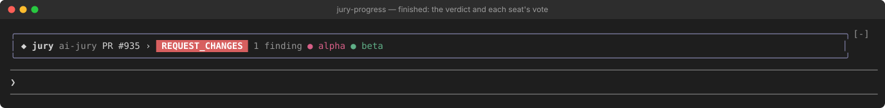
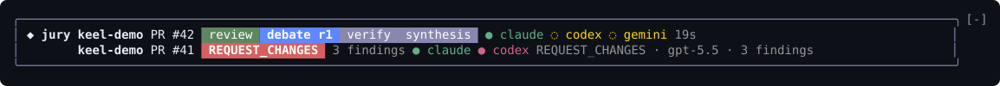

# Watch runs inside Claude Code: jury-progress

`jury-progress` is an optional Claude Code mod that shows your jury runs while the panel
deliberates: the phases, each seat with its model, and how each seat voted. It only reads. It never
runs `jury`, and it sees nothing but metadata (no reviewer output, diff or finding text).
The `jury` CLI and the `ai-jury` plugin do not need it, and other hosts (Codex, Cursor,
Antigravity) are unaffected.

This page is the short version. The mod's own
[README](../mods/jury-progress/README.md) is the full reference.

## What it shows

### The band above the prompt

A rounded card above the Claude Code prompt, with one row per run that is live or finished in
the last minute.


- The target: a `PR #N` or `issue #N` links to it on GitHub, and a `›` beside it opens the
  side panel on that run.
- The phases as one segmented bar: review, debate (with its round), verify, synthesis. Done is
  green, the current one blue, the rest grey. On a band narrower than 100 columns only the
  current phase shows, with how far along it is.
- Each seat in the current phase as a colored dot: answered (green), failed (red), still
  thinking (yellow).
- How long the run has been going.

When a run ends it stays for a minute with its verdict as a chip (green for an approval, red
for a request for changes or a failed run, amber otherwise), its finding count, and, on a band
of 100 columns or more, a dot per seat colored by how that seat voted. Ballots need ai-jury
1.25.0 or newer.



### Hover details

Point at a seat or a ballot dot and its row says more at the right end. A seat shows its model,
how long it took and what it found (`opus · 38.5s · 2 found (1 major, 1 minor)`), or that it is
still thinking. A ballot shows its verdict, model and finding count. The terminal draws this on
its own; no hook runs as the pointer moves.



### The `/jury-progress` side panel

`/jury-progress` opens a panel beside the conversation and closes it when it is open.


- A header with how many runs are running, then **LIVE** and **RECENT** lists with one row per
  run: its phase and age, or its verdict, and each seat with its model (or its ballot once the
  run is over).
- Click a run to open it in full: its target, review mode, decision and chair, the panel, the
  phase bar, then one row per phase with a line per seat (who answered, in how many seconds,
  how many findings and of which severity, or the error code of a seat that failed).
- A footer with where the events are read from, and Refresh and Close.

A toast announces a run's end (its verdict and finding count), or that it stopped without an
end record.

Next to keel's own mod, keel-progress, the band shows both: the jury runs and the keel runs
that drive them.

## How it finds runs

ai-jury writes each run's progress (`ai-jury.events.v1` NDJSON: the panel, one record per phase
result, the end) to a file of its own. The file goes to `$JURY_EVENTS_DIR` when that is set.
When it is not set, the file goes to ai-jury's cache directory plus `/events`
(`$JURY_CACHE_DIR/events`, else `$XDG_CACHE_HOME/ai-jury/events`, else
`~/.cache/ai-jury/events`), but only while a `.watched` file there reads `on`.

The mod leaves that marker, reading `on`, when a session starts. So every `jury` on the machine
writes where the mod reads, whether you ran it by hand or an agent or keel did, with no flag
or variable. This needs ai-jury 1.24.0 or newer. A `JURY_EVENTS_DIR` you set yourself is read
as it is and no marker is written; `off` turns the events off. A `--mock` run never writes
events.

Runs are session-scoped. A session shows the runs started in its folder or below it, which
includes those keel starts in the worktrees it makes inside the session's checkout. Other
sessions' runs are not shown and raise no toast, unless you turn on "Show other sessions' runs".
A run counts as live until its end record, or until `ps` no longer finds its process.

## Settings

In `/config`, under jury-progress:

| Setting | Default | What it does |
| --- | --- | --- |
| Watch the jury runs | on | Leave the `.watched` marker in ai-jury's cache so jury writes its events there. Off: only a `JURY_EVENTS_DIR` you set is read. |
| Refresh every (seconds) | 1 | How often the events directory is read while a run is live. |
| Runs above the prompt | 3 | How many runs the band shows before `+N more`. |
| Show other sessions' runs | off | Every jury run on the machine, not only this session's own. |
| Notifications | on | The toast when a run ends or stops. |

Turning watching off in one session turns the marker off for every session on the machine.

## Install

```bash
claude plugin marketplace add berkayturanci/ai-jury
claude plugin install jury-progress@ai-jury
```

Restart Claude Code. Installing ai-jury itself is covered in [install.md](install.md).

## Requirements

- Claude Code **2.1.287 or newer**, with mods enabled for your account.
- ai-jury **1.24.0 or newer** for the marker and the events; **1.25.0 or newer** for each
  seat's model and the ballots.

Before `claude plugin uninstall jury-progress`, turn Watch off (or delete
`<cache>/events/.watched`), or every jury on the machine keeps writing its metadata-only events
there.
