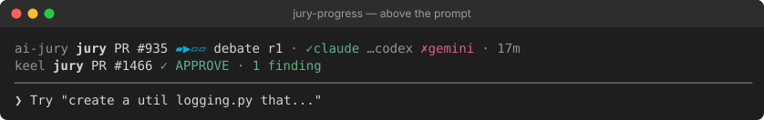
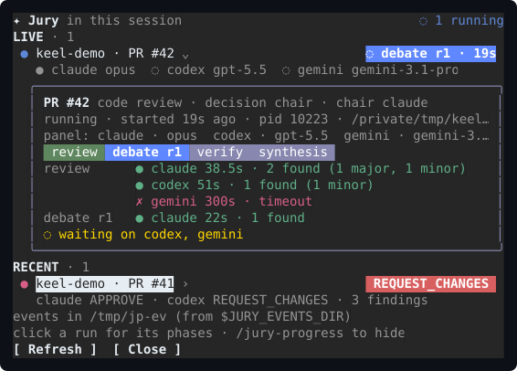
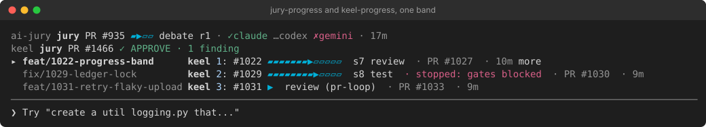

# jury-progress

An optional Claude Code mod that shows the live ai-jury runs inside Claude Code, while the
panel deliberates. It only reads: it never runs `jury`, and it sees nothing but metadata.

## Above the prompt

A rounded card with one row per run (live, or finished in the last minute):



- the target (a button: click it to open the pane on that run; no digit hotkey, so the band never
  takes the first key of a prompt)
- the phases as one segmented bar of chips: review, debate (with its round), verify, synthesis;
  done in green, the current one in blue, the rest grey. On a band narrower than 100 columns only
  the current phase shows, with how far along it is (`2/4`), and seats that do not fit wrap
  to the next line
- each seat in the current phase as a colored dot: `●` answered (green), `✗` failed (red),
  `◌` still thinking (yellow), in your terminal's own colors
- how long the run has been going

A run from another checkout carries that checkout's name in front. A finished run stays for a
minute with its verdict as a chip, green for an approval, red for a request for changes or a
failed run, amber otherwise, next to its finding count; markdown around the verdict
(`**COMMENT**`) is dropped. With more runs than
the band's rows, `+N more` points to the pane.

## The `/jury-progress` pane



The run you picked (or the newest) in full, as a card: its target, review mode, decision and
chair, the phase bar, then one row per phase (and debate round) with a chip per seat: who
answered, in how many seconds, how many findings, or the error code of a seat that failed; then
who it still waits on, or how it ended. Above the card, when it started and its pid. Below it,
the other live and recent runs, each a button to switch to.

## Notifications

A toast when a run ends (its verdict and finding count) or stops without an end record (its
process is gone, or its pid now belongs to a process that started later). A run that starts
and ends between two reads (a cache hit, a fast failure) still gets its toast; runs that were
already over when the session opened do not.

## How it finds the runs

ai-jury writes each run's progress (`ai-jury.events.v1` NDJSON: the panel, one record per phase
result, the end) to a file of its own. The records carry metadata only: no reviewer output, diff or
finding text. The file goes to `$JURY_EVENTS_DIR` when that is set. When it is not set, the file goes
to ai-jury's cache directory plus `/events` (`$JURY_CACHE_DIR/events`, else
`$XDG_CACHE_HOME/ai-jury/events`, else `~/.cache/ai-jury/events`), but only while a `.watched` file
there reads `on`.

This mod leaves that marker, reading `on`, when a session starts. So every `jury` on the machine
writes where the mod reads: one you run by hand, one an agent runs, one keel runs, and one in another
terminal. This needs ai-jury 1.24.0 or newer. A mod cannot set an environment variable for the
commands its session runs (Claude Code's `$.env.set` does not reach them), which is why the marker
is a file.

A `JURY_EVENTS_DIR` you set yourself is read as it is, and no marker is written; `off` turns the
events off. A `--mock` run never writes events. A run counts as live until its end record, or until
`ps` no longer finds its pid (or finds it held by a newer process). When `ps` cannot answer, a run
without an end record still counts as live.

## Settings

In `/config`, under jury-progress:

| Setting | Default | What it does |
| --- | --- | --- |
| Watch the jury runs | on | Leave the `.watched` marker in ai-jury's cache so jury writes its events there. Off: the marker is turned to `off`, and only a `JURY_EVENTS_DIR` you set is read. |
| Refresh every (seconds) | 2 | How often the events are read while a run is live; five times less often otherwise. A `jury` command also refreshes at once. |
| Runs above the prompt | 3 | How many runs the band shows before `+N more`. |
| Notifications | on | The toast when a run ends or stops. |

Next to keel's own mod, keel-progress, the band shows both: the jury runs and the keel runs
that drive them.



The images are captures of Claude Code 2.1.288 running the mods over demo runs, rendered as SVG.

## Install

You need ai-jury 1.24.0 or newer (installing ai-jury itself: [docs/install.md](../../docs/install.md))
and Claude Code **2.1.287 or newer**, with mods enabled for your account.

```bash
claude plugin marketplace add berkayturanci/ai-jury
claude plugin install jury-progress@ai-jury
```

Restart Claude Code. The `ai-jury` plugin and the `jury` CLI do not need the mod; other hosts
(Codex, Cursor, Antigravity) are unaffected.

## Develop

```bash
cd mods/jury-progress
claude plugin validate .
claude plugin test
claude --plugin-dir .
```

## Limits

- Turning watching off in one session turns the marker off for every session on the machine;
  they share ai-jury's cache.
- The marker outlives the session and the mod. Before `claude plugin uninstall jury-progress`, turn
  Watch off (or delete `<cache>/events/.watched`), or every jury on the machine keeps writing its
  metadata-only events there (the newest 20 runs are kept).
- When the mod creates the events directory first, it gets your umask's mode (usually 0755), not the
  0700 jury would give it. The run files are always 0600.
- Only the newest 20 runs are kept in the directory (ai-jury prunes it), and files untouched
  for a day are not read.
- A run on another machine (CI) is not shown; the pane reads the local directory only.
